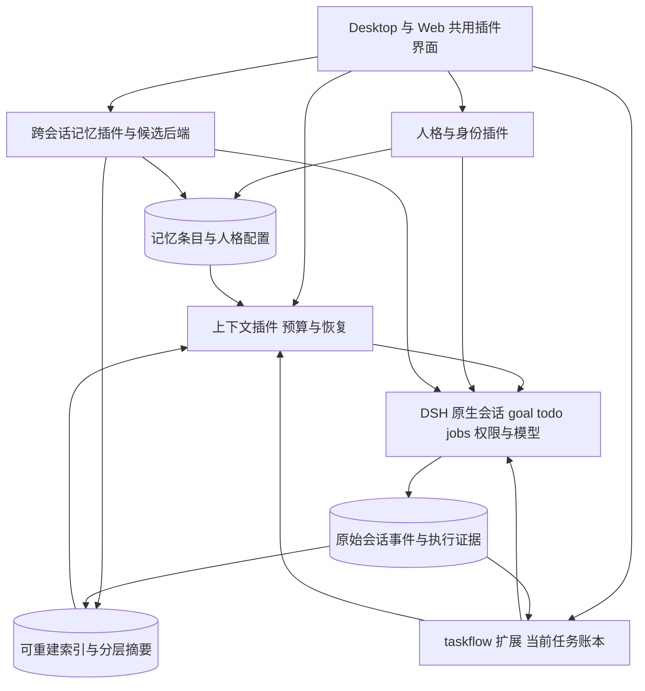

# DSH-PX 记忆与长会话设计研究

研究截止：2026-10-05。状态：设计候选，尚未接入或发布。

本研究面向跨会话记忆、可切换人格与身份，以及持续工作的长会话上下文和任务账本。建议沿用 DSH 执行与会话机制，优先复用合适的社区记忆组件，由 PX 补齐作用域、人格切换、任务状态和统一交互。先建立可比较的本机实验，再决定默认记忆后端。

## 阅读范围与证据等级

本地基线是 DSH-PX `0.3.3-alpha.1`、源码 `4ee88d069732ac1660a6535de98e9c2c618b7ee6`，锁定 DSH `0.2.0-rc.2`、源码 `639ed015397290b3745d163aafe02ffee4aa3f84`。查阅了现有插件实现、锁定宿主的类型与源码、产品官方文档、社区仓库和论文。

本文区分四种证据：

- **源码确认**：在上述锁定源码中可定位的能力和限制，不代表所有运行分支已经实测。
- **产品文档**：当前维护方描述的产品能力，不推导其闭源内部实现。
- **社区候选**：有公开实现、版本和许可证；未通过 PX 集成验收。
- **研究结果**：论文在指定模型、数据和条件下的结果；不是 PX 效果保证。

本轮没有安装社区记忆插件、调用付费模型跑横向评测、迁移日常历史、修改用户人格或替换压缩器。没有证明任何候选能使本项目“无限会话不降质”。网页抓取时间只证明此次可访问，不等于功能发布时间；没有明确发布日期的文档按“2026-10-05 查阅”处理。

## 一 先区分需要解决的问题

| 层次         | 保存什么                           | 生命周期与作用域                  | 典型错误                                       |
| ------------ | ---------------------------------- | --------------------------------- | ---------------------------------------------- |
| 人格与身份   | 名字、职责、表达风格、协作方式     | 可版本化角色配置                  | 把扮演身份当成模型实际能力，或切角色时改变权限 |
| 用户偏好     | 回答习惯、明确的长期约定           | 用户级，可覆盖或撤销              | 把一次性要求推广为永久偏好                     |
| 项目知识     | 架构决策、约定、环境陷阱           | 项目级，必要时限定分支、版本      | 旧版本结论污染新版本工作                       |
| 经历与证据   | 发生过什么、依据在哪里             | 会话事件、文件和工具结果          | 只留摘要，无法查证原文                         |
| 当前任务账本 | 当前目标、决定、进展、阻碍、下一步 | 单任务，连接原生 goal、todo、jobs | 旧进度覆盖新状态，重复执行已完成操作           |
| 活跃上下文   | 此次模型调用真正看到的材料         | 每次请求受预算限制                | 把所有记忆塞进每次请求，成本和干扰增长         |
| 程序性经验   | 可复用工作方法、适用条件           | 经验证后形成技能或运行手册        | 一次偶然成功就生成永久流程                     |

“保存了聊天记录”“模型能检索到记录”“模型在正确时机采用记录”是三件不同的事。工程上还要区分原始事实、模型归纳和用户确认的配置。

产品目标应是：**同一个逻辑会话能持续工作，必要信息可恢复，当前状态清楚。** 不要求每次调用携带整个历史，也不能承诺跨多次有损压缩后保留全部细节。

## 二 当前 DSH 和 PX 已经有什么

### 原生能力与缺口

| 能力           | 源码确认的现状                                                                                 | PX 需要补充的部分                              |
| -------------- | ---------------------------------------------------------------------------------------------- | ---------------------------------------------- |
| 人格           | `dsh-persona` 可以在 agent scope 中覆盖部署人格，提供 prefix、suffix 等配置                    | 易用的角色列表、会话绑定、版本、切换规则       |
| 预设           | `agentPresets.select()` 检查 turn boundary，开始首轮后拒绝切换                                 | 不应把工作中换人格实现成整套插件预设热切换     |
| Prompt 扩展    | `systemPrompt.section`、`systemPrompt.context`、assemble waterfall；动态上下文可记录为原生快照 | 分层注入、预算、读取来源和失效处理             |
| 自动压缩       | 旧历史摘要加近期原文，自动压力触发、溢出恢复和 `/compact`                                      | 任务状态保真、压缩后检索和可理解的状态提示     |
| 压缩事务       | start、summary、end 事件，记录源序列、模型和用量；要求工具调用与结果配对                       | 用原生事务接口接入，不能随意删除历史数组       |
| 工具结果裁剪   | 基础组合启用头尾保留的确定性裁剪                                                               | 关键中间内容的按需恢复与引用提示               |
| 图片卸载       | 基础组合包含 image-offload                                                                     | 视觉证据的说明与可重新读取入口                 |
| 目标           | 原生 goal 保存单个当前目标，带 revision；重启后状态保留、自动继续需重新激活                    | 账本关联目标，不另建一套目标调度器             |
| 待办与后台工作 | 原生 todo、jobs、子代理与会话事件                                                              | 聚合其现状和证据，不复制它们的生命周期         |
| PX 执行证据    | `task_review`、`task_evidence`、`task_checkpoint`                                              | 从可选交接笔记扩展为轻量、结构化的当前工作视图 |
| 跨会话记忆     | 当前 PX 没有专用的长期记忆产品层                                                               | 记忆作用域、检索、修改、遗忘、隔离和 UI        |

主要源码依据：[人格](https://github.com/deepseek-ai/deepseek-harness/blob/639ed015397290b3745d163aafe02ffee4aa3f84/packages/preset/persona/src/index.ts)、[预设选择](https://github.com/deepseek-ai/deepseek-harness/blob/639ed015397290b3745d163aafe02ffee4aa3f84/packages/preset/agent-preset-registry/src/index.ts)、[系统提示注册](https://github.com/deepseek-ai/deepseek-harness/blob/639ed015397290b3745d163aafe02ffee4aa3f84/packages/core/system-prompt/src/index.ts)、[压缩接口](https://github.com/deepseek-ai/deepseek-harness/blob/639ed015397290b3745d163aafe02ffee4aa3f84/packages/compaction/compaction/src/index.ts)、[goal](https://github.com/deepseek-ai/deepseek-harness/blob/639ed015397290b3745d163aafe02ffee4aa3f84/packages/goal/goal/README.md)、[PX taskflow](../../packages/dsh-px-taskflow/src/index.ts)。

### 对长会话尤其重要的具体行为

锁定版本的压缩策略默认 `thresholdRatio=0.8`、`retainRatio=0.16`、额外 `headroomTokens=65536`。实际阈值取窗口比例与“窗口减输出预留、减额外余量”的较小值，不能简单描述为“到 80% 才压缩”。支持按 provider/model 覆盖策略；这些是源码默认值，不是本机每个模型的已验证有效配置。[配置实现](https://github.com/deepseek-ai/deepseek-harness/blob/639ed015397290b3745d163aafe02ffee4aa3f84/packages/compaction/compaction-basic/src/config.ts)

基础组合的工具结果裁剪阈值是 8192 个 Unicode 码点，保留头部 4096、尾部 1024；这不是语义摘要，也不是 token 数。若关键报错位于中间，单看裁剪后的上下文会漏掉它。原始事件与 PX 证据分页提供恢复基础，但仍需要让 agent 知道何时去取。[裁剪配置](https://github.com/deepseek-ai/deepseek-harness/blob/639ed015397290b3745d163aafe02ffee4aa3f84/packages/compaction/compaction-tool-result-pruner/src/config.ts)

原生摘要已经包含目标、代码、错误、待办、当前工作、下一步和关键约束。缺口并非“没有总结”，而是缺少对这些信息的独立状态管理、事实核验和针对当前问题的恢复。当前摘要模板内置在实现里，公开配置没有任意 summary prompt 字段；若替换算法，应使用可替换 compaction 后端，不能假定改一项设置即可。[摘要实现](https://github.com/deepseek-ai/deepseek-harness/blob/639ed015397290b3745d163aafe02ffee4aa3f84/packages/compaction/compaction-basic/src/summarizer.ts)

### 上游最新变化

截至研究日，官方最新可见发布为 **`0.2.1-alpha.1`，2026-10-03**，晚于 PX 的锁定版本。它包含目标队列修复、更多会话诊断工具、会话列表性能改善，以及 UI 扩展 ID、插件元数据和 invariant 导出的变化。该版本的存在不代表 PX 已升级，也不证明其解决了长期记忆需求。[官方发布说明](https://github.com/deepseek-ai/deepseek-harness/releases/tag/dsh-v0.2.1-alpha.1)

建议新功能实验先固定当前运行基线，另设上游兼容检查。宿主升级和记忆算法变更分别验收，避免同时变化后无法解释效果或回归。

## 三 成熟产品和框架提供的参考

下表的“适合程度”是面向 PX 本机产品的工程判断，并非市场排名。当前文档有功能说明，不等于我们已进行长期实测。

| 产品或框架                  | 当前可确认的做法                                                             | 可借鉴的部分                                     | 对 PX 的限制或代价                                     |
| --------------------------- | ---------------------------------------------------------------------------- | ------------------------------------------------ | ------------------------------------------------------ |
| Codex 本地记忆              | 空闲后后台提炼，区分记忆生成与使用开关，可按会话控制；必需规则仍放 AGENTS.md | 记忆不阻塞主任务、低配额时节制处理、读写分开控制 | 官方产品行为不等于可以直接移植其内部后端               |
| Claude Code                 | 短 MEMORY.md 索引常驻，主题文件按需读；项目自动记忆可查看编辑                | 少量常驻摘要加渐进读取；明确项目边界             | 文件数量和陈旧信息仍需管理，不能把所有说明常驻         |
| Cursor                      | 当前规则支持全局、项目、文件匹配和手动应用                                   | 作用域和按需启用，比一个巨型人格提示更可靠       | 旧 Memories 页面不能单独证明当前自动记忆功能的完整状态 |
| OpenClaw                    | 记忆和会话压缩分层，可在压缩前安排记忆写回                                   | 在关键上下文离开窗口前保存持久状态               | 静默额外回合也有耗时；写回成功须以实际结果判断         |
| Letta 新 Agent SDK          | 文件化记忆；system 部分常驻，其他文件按需读取，支持 persona/human 与后台整理 | 身份与用户资料分开、共享记忆边界、分层读取       | 完整 Letta 是另一套 agent 运行体系，不宜替换 DSH       |
| LangGraph/LangMem           | 线程状态与跨线程 Store 分离，区分事实、经历和程序性记忆                      | 数据分类、命名空间、同步与后台写入的取舍         | 适合参考设计，不应为了记忆引入第二个执行框架           |
| Mastra Observational Memory | Observer 提炼观察，Reflector 合并，支持后台缓冲和有界上下文                  | 异步预计算、批量激活、保留近期原文               | 摘要仍有损；异步结果可能陈旧，持续观察有成本           |
| Mem0                        | 提供记忆新增、更新与搜索，LLM、embedding、向量库可配置                       | 自动事实提取和可替换检索后端                     | 本地存储不等于无外部模型调用；不是长任务账本           |
| Graphiti/Zep 路线           | 时间化图谱、事实更新和历史关系                                               | “以前成立、现在失效”的事实表达                   | Python 和图数据库增加本机依赖；第一版收益未证明        |
| Hindsight                   | retain、recall、reflect，结构化事实和经历、混合召回                          | 证据与推断分开，时间和实体相关检索               | 自托管涉及 PostgreSQL 等服务；需要评估资源和请求开销   |
| Beads                       | 面向 agent 的依赖任务图，当前采用 Dolt                                       | 阻塞依赖、待执行项、持久任务状态                 | 我们已有 goal/todo；直接加入可能形成双账本             |
| LCM 社区实现                | 原文归档，分层摘要指回来源，提供搜索与展开                                   | 压缩后还能查原文                                 | “无损”指数据可取回，不代表摘要或模型理解无损           |

产品资料：[Codex](https://learn.chatgpt.com/docs/customization/memories)、[Claude Code](https://code.claude.com/docs/en/memory)、[Cursor Rules](https://prod.cursor.com/help/customization/rules)、[OpenClaw](https://docs.openclaw.ai/concepts/memory)、[压缩前写回](https://docs.openclaw.ai/reference/session-management-compaction/housekeeping)、[Letta 新 SDK](https://docs.letta.com/agent-sdk/memory)、[LangGraph](https://docs.langchain.com/oss/javascript/concepts/memory)、[Mastra](https://mastra.ai/docs/memory/observational-memory)、[Mem0](https://docs.mem0.ai/open-source/overview)、[Graphiti](https://github.com/getzep/graphiti)、[Hindsight 部署](https://hindsight.vectorize.io/developer/installation)、[Beads](https://github.com/gastownhall/beads)、[LCM 社区项目](https://github.com/lossless-claude/lcm)。均于 2026-10-05 查阅。

### 本次发现的时效陷阱

- Letta 常见旧教程围绕数据库 Memory Blocks；官方目前已将该 SDK 文档归入 legacy，新 SDK 强调 MemFS 和文件化记忆。不能混用两套 API 和部署判断。[新版](https://docs.letta.com/agent-sdk/memory)、[旧版](https://docs.letta.com/v1-sdk/memory/memory-blocks)
- Beads 当前采用 Dolt；JSONL 是交换或导出形式，不能按旧文章假定它就是主存储。初期只借鉴账本思想更省维护。[当前仓库](https://github.com/gastownhall/beads)
- Anthropic 2026-03-24 的 harness 实验已经强调随模型改进逐个移除不再必要的流程。不能照搬较旧的强制冲刺、多 agent 层级和反复重启套路。[工程文章](https://www.anthropic.com/engineering/harness-design-long-running-apps)
- Claude 当前压缩文档区分按需与阈值压缩，按需方案带 `compact-2026-09-04` beta 标识；OpenAI 有服务端与独立 compaction。它们是供应商特定能力，不能推导为 DS Flash 的可用接口。[Claude](https://platform.claude.com/docs/en/build-with-claude/compaction)、[OpenAI](https://developers.openai.com/api/docs/guides/compaction)
- Cursor 旧 Memories 页搜索结果很容易出现；本研究只把它当作历史参考，推荐依据采用当前维护的 Rules 文档。

## 四 DSH 社区插件的具体选择

版本与更新时间是研究时的仓库快照。pushed_at 表示仓库活动，不证明发布包可安装或稳定。接入必须另行核对 npm 归档、完整性、运行合约和 Windows 行为。

| 候选                           | 本轮确认                                                                                  | 价值                                                                    | 需要验证的重点                                                                          | 建议                           |
| ------------------------------ | ----------------------------------------------------------------------------------------- | ----------------------------------------------------------------------- | --------------------------------------------------------------------------------------- | ------------------------------ |
| haitang1/dsh-memory            | package 0.5.0；HEAD `15de1c7`；2026-09-30 更新；MIT                                       | 自动会话提炼、全局/工作区/项目作用域、记忆工具、版本回退，已有 Web 设置 | 默认自动提炼频率、范围选择、并发更新、中文召回、删除后是否再次提炼；0.2.0-rc.2 真机适配 | 自动记忆方向优先候选           |
| aerovato/operator-memory       | DeepSeek adapter 0.2.1；HEAD `e394f1c`；2026-10-04 更新；BSD-3-Clause；peer 覆盖当前 rc.2 | Markdown 项目知识、个人与项目分区，无向量库或后台整理 agent             | 长会话内知识刷新、文件维护成本、索引膨胀、persona scope                                 | 轻量工程记忆方向优先候选       |
| seriousz158/dsh-memory         | dsh-git-memory 0.9.3；2026-10-01 活动；MIT                                                | Git 支持的本地可追踪记忆                                                | package 的宿主 peer 仍指向 0.1.x；测试脚本有 zsh，Windows 和新协议需核对                | 保留候选，暂不默认集成         |
| plur-ai/dsh-plugin             | 2026-08-15 活动；Apache-2.0；公开兼容表停在 0.1.x                                         | 本地 YAML、直接向 prompt 提供记忆                                       | 0.2.x 的 API、作用域和记忆更新一致性                                                    | 设计参考，优先级较低           |
| MetheusNull/dsh-passive-memory | 0.1.0-alpha.1 源码预览；2026-08-15 活动；MIT                                              | 原始事件是证据，记忆为可重建派生视图                                    | 仓库明确是实验性源码预览；依赖特定源码布局                                              | 借鉴来源追踪，不作为成熟现成包 |

来源：[haitang1](https://github.com/haitang1/dsh-memory)、[Operator](https://github.com/aerovato/operator-memory)、[dsh-git-memory](https://github.com/seriousz158/dsh-memory)、[PLUR](https://github.com/plur-ai/dsh-plugin)、[Passive Memory](https://github.com/MetheusNull/dsh-passive-memory)。

针对前两个候选还抽查了 Host 接线：

- Operator 当前通过 `system-prompt/assemble` 注入，按 Agent 对象缓存首次构造的 preamble Promise。由此推断：同一存活 Agent 的注入快照不会在每次 assemble 时重新读取；agent 仍可用工具读文件。这是长会话刷新策略需要验证的地方，不是已经实测确认的故障。[固定版本源码](https://github.com/aerovato/operator-memory/blob/e394f1c6d99daf11f77d73a7f2f302826a372322/packages/deepseek/src/index.ts)
- haitang1 使用 `systemPrompt.context`，并在根 agent 结束回合时安排提炼；包含 sessionQuery 读取路径。其可选本地 hashed-vector 检索不能仅凭“vector”名称视为训练式语义 embedding，中文同义表达召回需要单独测试。[固定版本源码](https://github.com/haitang1/dsh-memory/blob/15de1c791bbcb5be2c9b0c2096eddedcaa61cc17/lib/index.js)、[工具说明](https://github.com/haitang1/dsh-memory#tools)

不要同时启用两个自动写入和全局注入的记忆引擎。应逐个作为候选后端对照，用 PX 的薄适配层统一默认行为。通过验收后，在 Pack 清单中固定版本、来源和许可证；不把上游源码全部复制为自制插件，也不长期手工修改用户 node_modules。

## 五 近期研究及其工程含义

论文日期采用作者页的提交或修订日期。下面只提炼与本产品有关的设计，不将不同数据集的成绩拼成一个排名。

| 研究                      | 时间与状态                            | 主要启发                                                                                 | 对 PX 的使用边界                                                   |
| ------------------------- | ------------------------------------- | ---------------------------------------------------------------------------------------- | ------------------------------------------------------------------ |
| MemoryArena               | 2026-02 首稿，09-17 修订；ICML 2026   | 记忆问答成绩好，不等于跨会话行动可靠；测试应让前次经验影响后续任务                       | 验收要包含真实工具操作和任务依赖，不能只问“你记得什么”             |
| LongMemEval-V2            | 2026-05-12；作者标为 Work in Progress | 测静态事实、动态状态、流程、环境陷阱与错误前提；基于 coding agent 的证据收集也有延迟成本 | 建立项目知识和历史证据用例；不只存用户偏好                         |
| MAGE                      | 2026-06-04；预印本                    | 按执行状态与分支组织经历，隔离错误路径；语义相似不是当前有效状态                         | 账本要区分当前方案、作废方案、失败尝试、未确认结论                 |
| Proactive Memory Agent    | 2026-07-09；预印本                    | 适时提醒可能比一直注入整份记忆更有效                                                     | 后续可做失败循环或漏约束检测；第一版不默认每步多跑一个 agent       |
| Total Recall at What Cost | 2026-08-12；预印本                    | 自动提炼和反思可能抵消少发历史的成本收益                                                 | 统计提炼、检索、压缩和主模型总成本，不只统计主请求                 |
| JAM                       | 2026-09-28；很新的预印本              | 保留原始记录和导航摘要，按当前问题构建证据；包含训练阶段                                 | 可借鉴按需深入读取；不能把论文训练收益直接套到未训练 DS Flash      |
| RLM                       | 2025-12 首稿，2026-05-11 修订         | 把长材料作为可程序化读取的外部环境，分段处理                                             | 适合历史调查等按需能力，不等于持久人格或日常任务状态管理           |
| LCM                       | 作者页列 2026-02-14；预印本           | 分层摘要 DAG 仍保留通向原文的路径                                                        | 适合可恢复压缩；论文特定长文本测试不证明长期编程全面优于现有客户端 |

论文原文：[MemoryArena](https://arxiv.org/abs/2602.16313)、[LME-V2](https://arxiv.org/abs/2605.12493)、[MAGE](https://arxiv.org/abs/2606.06090)、[主动记忆](https://arxiv.org/abs/2607.08716)、[成本研究](https://arxiv.org/abs/2608.11879)、[JAM](https://arxiv.org/abs/2609.34385)、[RLM](https://arxiv.org/abs/2512.24601)、[LCM](https://arxiv.org/abs/2605.04050)。

成本研究本身也有重要限制：成本实验包含合成对话，准确率只来自 LoCoMo 子集，Hindsight 的入库模型未完全随实验变量控制。因此可以据此要求测量总开销，不能据此宣布某个产品在 PX 上最便宜或最差。[方法与限制](https://arxiv.org/html/2608.11879v1)

综合判断：优先采纳“原文可恢复、状态有来源、工作记忆有预算、按需检索、错误状态可作废”的共同方向。先不采用训练记忆策略、持续反思 agent 群、全量知识图谱或默认递归调用等高成本部分。

## 六 三种产品方案

| 方案                       | 组成                                                      | 优点                                             | 主要不足                                             | 判断                             |
| -------------------------- | --------------------------------------------------------- | ------------------------------------------------ | ---------------------------------------------------- | -------------------------------- |
| A 轻量社区整合             | 一个社区记忆插件，加角色 UI，保留 DSH 默认压缩            | 接入较快、维护负担小、符合整合包定位             | 长会话状态保真和原文召回仍有缺口；受上游默认策略影响 | 适合作为对照实验或最小交付       |
| B 原生协同加可替换记忆后端 | DSH 会话和压缩 + 社区记忆候选 + PX 人格、账本和上下文薄层 | 兼顾整合与自主体验；可分别升级替换；不另造执行器 | 需要明确各层唯一的数据权威、压缩边界和并发规则       | **推荐方向**                     |
| C 外部完整记忆服务         | Mem0、Hindsight、Graphiti 等后端 + PX/DSH 适配            | 检索与长期知识功能多，可扩展大资料库             | 服务、模型、数据库和备份链更复杂；仍需账本与人格     | 作为以后可选后端，不作为默认依赖 |

B 不意味着先自研全部记忆算法。先以原生无记忆、Operator、haitang1 三组做相同用例；满足需求的部分直接复用。只有作用域、版本更新、长会话状态或产品交互确有缺口时补适配。若两个社区后端都无法达到最低行为要求，再实现最小本地后端，并记录未复用的具体原因。

## 七 推荐架构

拟议安装边界：

- `dsh-px-personas`：用户可见的角色功能包；身份配置与会话选择。
- `dsh-px-memory`：用户可见的记忆功能包；设置、查看、编辑、忘记和候选后端适配。名称暂定，不表示现已存在。
- `dsh-px-taskflow`：扩展现有执行记录和 checkpoint，不再增加平行的 todo 插件。
- `dsh-px-context`：基础能力，配置放内置设置；负责上下文预算、恢复入口及诊断。初版以原生 compaction 为唯一压缩执行者。
- 原文、goal、todo、jobs、权限仍由 DSH 提供。索引是可重建缓存，不能取代原始记录。

按当前接口，大部分 Host 和界面能力有插件实现路径；尚未做原型，所以不承诺零客户端补丁。若会话头部缺少稳定的角色选择插槽，可先放会话菜单；只有确认缺口后才增加小型共享 Web UI 接口。Desktop 的安装、签名与更新不需要承担记忆业务。

任意后台压缩或自定义摘要校验不是现成配置项。第一版避免两个压缩器同时订阅 pre-step；后续若确实替换压缩后端，必须完整遵守 DSH 事务、取消、工具配对、持久化和上下文预算契约。

## 八 人格与身份如何切换

建议将**能力模式**和**协作角色**分开：前者决定插件组合与工具，后者决定身份说明、表达方式、关注重点及专属记忆。

示例：标准模式下选择“开发搭档”“研究助手”“写作编辑”；用户可以改名称、职责和风格。事实、权限和实际模型身份由宿主提供，不因角色命名而改变。用户不必接触 prompt 顺序、scope key 或文件路径。

拟议切换语义：

1. 每个会话保存 `personaId + revision`，而不是跟随全局最近一次选择。
2. 空闲时切换，从下一轮生效；运行中选择则标明“下轮生效”，不在一次工具链中途改变身份。
3. 项目事实和当前任务继续保留；角色专属记忆随角色变化。共享的是哪些内容应可见。
4. 已写入当前会话的旧角色文字不会凭一次切换就从历史消失。需要严格隔离时使用新会话，而不是承诺“切换即遗忘”。
5. 定时任务保存自己的角色选择，避免被用户当前前台角色影响；子 agent 在创建时获得明确配置快照。
6. 角色本身由用户维护。自动记忆可以提出建议，但不能悄悄改名字、职责或长期风格。
7. 编辑角色后，已有会话显示可采用的新版本；避免全局修改让进行中的任务突然改变行为。

UI 建议仅保留一个轻量角色选择器；详情放设置。不要再增加第二条会话顶栏。

## 九 跨会话记忆如何工作

### 保存与检索

默认先做“少量固定材料 + 相关条目检索 + 原文深入读取”。固定材料是角色、用户明确长期偏好、项目索引；动态事实放请求后部或原生动态上下文，减少无意义的早期 prompt 变化。

一个条目至少表达：内容、类型、作用域、来源、记录时间、适用版本或环境、状态，以及替代了哪条旧记录。置信度可供排序，但不把模型自报数字当作正确性证明。

来源尽量使用原生 session ID、event seq、tool call ID 或文件版本；用户界面展示来源会话和时间，不要求用户理解这些标识。

作用域优先级建议：当前明确指令、宿主和项目明确规则、当前已确认状态、适用的长期记忆。记忆中的引文或第三方文件不提升为授权。个人通用偏好与项目事实分开；目录移动、Windows 短路径和 Git worktree 的项目归属需规范化，不能只用原始路径字符串拼 key。

读取流程：先按用户、项目、角色和有效性过滤，再进行关键词与元数据检索；仅在中文同义词和长资料测试证明不足后加入训练式 embedding 或 reranker。对“上次为什么放弃方案 A”这类问题，可再委托一次有预算的 DS Flash 历史调查，返回来源而非整段旧聊天。

### 写入、纠正和遗忘

- 用户明确“记住”时直接保存并可撤销；一句话的临时要求只留在当前任务。
- 自动学习按完成的事件批量提炼，保留提炼游标，不每轮扫描全部历史。
- 项目内低风险事实可自动记录并显示撤销入口；跨项目偏好或人格改变应作为建议，避免过度推广。
- 用户说“改成”“不再”“刚才不对”时，应更新有效状态并保留替代关系，不简单追加两条互相冲突的记忆。
- 忘记操作撤销条目与派生索引，同时阻止同一来源被后台再次提炼复活。遗忘条目和删除原会话是两个不同操作，应说清楚。
- 运行状态、价格、版本、端口等易变事实保存核验时间，使用前重新查证；不会因为记忆里存在就永远视为当前事实。
- 个人记忆默认位于用户数据目录。只有用户主动选择共享的项目约定才导出到仓库文件，避免把日常对话提交进 Git。

初版 UI：会话菜单中有“使用记忆”“允许形成记忆”，并有“此次临时对话”；被采用时显示轻量的“参考了 3 条记忆”，展开可查看、编辑或忘记。不要把每次自动提炼变成弹窗审批。

## 十 单会话上下文与账本

### 账本记录当前状态

账本不应是一篇无限增长的开发日记。建议保留：

| 字段           | 更新方式                               | 为什么要保留                             |
| -------------- | -------------------------------------- | ---------------------------------------- |
| 目标与验收条件 | 关联原生 goal，用户变更后修订          | 避免做完局部就宣布全部完成               |
| 当前要求与边界 | 明确指令及其来源                       | 压缩后不漏掉用户纠正                     |
| 有效决策       | 选择、理由、适用条件；旧决策标记作废   | 不反复走回已否定路线                     |
| 当前进度       | 关联原生 todo 与实际事件               | 不增加第二套可互相矛盾的待办             |
| 已证实与待证实 | 检查结果、证据和对应代码版本           | 区分“运行命令成功”和“功能验收成功”       |
| 失败尝试       | 方法、失败现象、适用环境、是否仍可重试 | 避免无意义重复，不永久禁止有条件的新尝试 |
| 活跃工作       | 原生 job/subagent 标识与已知状态       | 压缩、重启后先核对效果，再决定重跑       |
| 阻碍与下一步   | 当前阻碍、解除条件、一个近期行动       | 恢复工作时不用重新猜                     |
| 产物           | 文件、提交、发布等实际引用             | 降低交付遗漏                             |

确定性事件由 Host 更新；需要理解语义的决定、经验由 agent 或批量整理提出。使用 revision 和来源水位提交，拒绝迟到摘要覆盖较新的用户纠正。fork 后生成该分支自己的任务状态，不能继续共写父会话账本。

原生 goal/todo/job 是对应状态的权威；账本只是关联与展示。测试证明某次提交通过，不自动证明后续提交通过。文件备份或上下文检查点也不等于外部操作可以自动撤销。

### 上下文装配顺序

1. 保留宿主原生指令、当前用户输入和工具协议。
2. 加入有界角色与明确长期规则。
3. 加入当前任务账本的短快照。
4. 保留近期完整交互和未闭合工具调用。
5. 按当前问题加入有来源的记忆或历史片段。
6. 其余历史通过分层摘要与原文查询保留可达性。

预算依据当前模型实际能力和 Host 输出预留计算；不能硬写所有模型共用的“90 万 token”，也不能只按中文字符估算。先沿用宿主计量，再用实际请求用量校准。

不建议第一版改变默认压缩模板。先让账本作为压缩之外可重新注入的状态，让 agent 可以检索被压缩掉的证据；这更容易辨别收益。若仍频繁丢失关键材料，再比较阶段摘要、分层摘要 DAG 与自定义 compaction 后端。

### 压缩与恢复的必要行为

- 压缩前保存已完成事件的账本水位；压缩后确认该水位可读取。
- 摘要超时、取消或输出截断时保留原历史，不标记成功；不无限重试消耗额度。
- 关键约束、开放任务和未完成调用不能只依赖一句模型总结。
- 后台摘要只能压缩已固定的旧片段；不能把生成期间的新消息误算为已处理。
- 模型切换到更小窗口时重新计算预算；不得把另一个供应商的不透明 compaction item 当成通用记忆格式。
- 查原文失败应说明记录已删、索引未完成或不可读取，不能编造缺失部分。

## 十一 性能与维护约束

推荐 DS Flash 承担有需要的提炼、合并和历史调查，主 agent 不必更换模型。具体部署中的模型 ID、结构化输出、窗口和价格需原型时核实；“用 Flash”本身不证明成本低。

默认轻量路径应没有额外模型调用：无新信息时不提炼，明确的字段和工具结果由程序处理。后台工作按项目去重、限并发、可取消，有失败退避和每日可配置预算。只有达到事件量或空闲条件才整理。

压缩若沿用主模型可能复用缓存，改用较便宜的模型可能重付整段输入费用。因此应比较实际总费用和耗时，不按输出单价直接决定。跨会话检索、账本更新与会话压缩不必都用同一个模型。

本机第一版优先既有 Host 存储能力、可编辑文件和可重建索引，不增加常驻 Python、图数据库和 Docker。若使用 SQLite，需验证 Node 与打包兼容及中文检索质量；不在研究阶段提前固定存储实现。

维护信息只保留版本、错误计数、处理水位和用量。诊断原文按需查看，不在公共仓库留个人会话、密码、QA 数据或全量开发日志。升级先备份业务状态，索引允许重建；插件关闭后 agent 应仍能用原生历史继续工作。

## 十二 分期功能清单

优先级是实施顺序，不表示当前线上缺陷等级。难度考虑插件适配、数据一致性和验收成本。

| 阶段         | 功能                              | 优先级 | 难度   | 验收重点                                   |
| ------------ | --------------------------------- | ------ | ------ | ------------------------------------------ |
| 基线实验     | 原生、Operator、haitang1 三组对照 | 必做   | 中     | 同任务、同主模型、同预算，记录确切候选版本 |
| 基线实验     | 长会话与跨会话测试集              | 必做   | 中     | 中文、工具输出、版本变化、用户纠正         |
| 基线实验     | 当前上下文与压缩用量诊断          | 必做   | 中     | 区分阈值、输出预留、实际输入和估算         |
| 首个可用版本 | 角色创建、编辑、删除              | 高     | 低至中 | 不修改权限和实际模型身份                   |
| 首个可用版本 | 会话角色绑定及下轮切换            | 高     | 中     | 重启保持，运行中不变更当前调用             |
| 首个可用版本 | 全局、项目、角色记忆作用域        | 高     | 中至高 | 不串项目、不混角色、不误识 worktree        |
| 首个可用版本 | 明确记忆的保存、编辑、忘记        | 高     | 中     | 修正和删除对下次使用有效                   |
| 首个可用版本 | 会话记忆读写独立开关              | 高     | 中     | 临时会话不生成长期记忆                     |
| 首个可用版本 | 来源与有效时间展示                | 高     | 中     | 每条可回到来源或说明来源失效               |
| 首个可用版本 | 当前账本关联 goal/todo            | 高     | 中     | 不出现平行状态源                           |
| 首个可用版本 | 决策、约束、阻碍和下一步          | 高     | 中     | 压缩后仍可恢复当前版本                     |
| 首个可用版本 | 执行证据、任务与产物关联          | 高     | 中     | 不虚构通过、不引用进行中结果               |
| 首个可用版本 | 压缩后账本恢复                    | 高     | 高     | 连续多次压缩不回到过时状态                 |
| 首个可用版本 | 有界历史搜索和原文读取            | 高     | 中至高 | 关键中间输出可取回；读取有预算             |
| 首个可用版本 | 用量、处理水位和错误状态          | 高     | 中     | 后台故障可见，不阻塞普通对话               |
| 第二阶段     | 自动批量提炼和去重                | 高     | 高     | 不每轮扫描全库，不生成大量无用条目         |
| 第二阶段     | 冲突、替代关系和过期再核验        | 高     | 高     | 最新明确纠正覆盖旧偏好                     |
| 第二阶段     | 删除来源后的派生数据处理          | 高     | 高     | 不被下一轮自动提炼复活                     |
| 第二阶段     | 角色版本、定时任务和子代理快照    | 中     | 中至高 | 跨窗口与后台任务语义稳定                   |
| 第二阶段     | 跨会话项目接力                    | 高     | 中至高 | 能定位有效产物和未完成工作                 |
| 第二阶段     | 阶段摘要与来源展开                | 中     | 高     | 索引可重建，源事件引用准确                 |
| 第二阶段     | 索引重建、迁移和回退              | 高     | 中至高 | 更新不丢业务数据，不强迫全量升级 Desktop   |
| 第二阶段     | 自选检索增强                      | 中     | 中至高 | 中文召回确有改善才默认启用                 |
| 后续实验     | 选择性记忆提醒                    | 中     | 高     | 减少失败循环，不增加过多插话               |
| 后续实验     | 异步压缩预计算                    | 中     | 高     | 正确处理新消息、取消和来源水位             |
| 后续实验     | 自定义压缩后端与 DAG              | 中     | 高     | 原生事务与恢复完整，收益超过复杂度         |
| 后续实验     | 经验转为可复用技能                | 中     | 高     | 经多个任务验证，有适用范围与撤销           |
| 后续实验     | 外部记忆后端                      | 低     | 高     | 资源、延迟和维护收益明确                   |
| 远期研究     | 学习式召回、反思策略、跨设备共享  | 低     | 很高   | 需独立目标、预算和适用性评估               |

“首个可用版本”仍应按风险拆成候选增量，不承诺一次发布覆盖所有高级算法。先使角色、记忆条目、账本和原文读取组成一个可验证闭环；自动学习和更换压缩器随后推进。

## 十三 验收设计

### 硬标准

以下是建议的发布门槛，不是已经通过的结果：

1. 保存、修改、删除、禁用、重启、fork 的结果符合所声明的作用域和版本。
2. 两个窗口或 agent 同时更新时不静默覆盖；迟到提炼不能覆盖新纠正。
3. 选定人格在下一轮生效，权限、工具模式和未完成工作不被暗改。
4. 原生历史可读取，引用能够定位；删除或缺失来源时有明确状态。
5. 账本不虚报测试通过、不把陈旧证据用于新提交，不把已结束工作重新列为运行中。
6. 至少覆盖三次连续压缩及重启恢复；同时包含用户改需求、失败尝试和未完成 job。
7. 摘要超时、网络失败、取消和无效结果不会损坏会话，也不会无限自动重试。
8. 从大窗口模型切到小窗口模型时能调整预算或明确报告限制。
9. 插件禁用后仍可使用原生会话；升级和回退保留记忆、人格和任务业务数据。
10. Web 与 Desktop 分别检查实际入口、状态更新和恢复，不能互相替代。

记录的正确性、可恢复性和范围隔离可以是硬标准。模型是否每次都采用正确记忆、任务是否更高效是概率性指标，不能伪装成确定性软件断言。

### 效果与成本指标

| 维度         | 测量方式                                                    |
| ------------ | ----------------------------------------------------------- |
| 真正完成任务 | 运行结果、文件、测试和用户要求是否满足                      |
| 约束保持     | 用户纠正、限定范围和明确禁止事项的遵守情况                  |
| 过时记忆采用 | 在已给新事实的情况下仍使用旧事实的比例                      |
| 重复劳动     | 已结算操作被无必要重跑的次数                                |
| 召回质量     | 所需证据是否找到，是否带来源，是否引入无关项目材料          |
| 恢复效率     | 重启或压缩后到第一次有效行动的时间与 token                  |
| 用户负担     | 需要重述背景、纠正进度或清理记忆的次数                      |
| 总开销       | 主 agent、提炼、检索、重排、反思和压缩的总 token 与实际计费 |
| 响应体验     | 前台等待、后台积压、P50/P95 延迟；区分冷启动与热缓存        |

先做约 12 类代表场景，每个关键场景做少量重复以排除偶然结果；不先跑昂贵全量榜单。测试至少覆盖：跨会话偏好、改口、项目隔离、人格切换、三轮压缩、工具中间证据、失败路径作废、后台工作核对、历史删除、模型切换、并发和升级恢复。保存脱敏数据与固定任务，再扩大样本。

对照组先固定主模型和上下文预算；DS Flash 只用于需要的辅助工作。若改变主模型，单独报告，不能把模型提升算作插件收益。短任务、长任务、中文事实召回和编程完成率分开看；没有实际效果提升时也可以确认软件功能已实现，但不宣传“更聪明”。

## 十四 下一步建议

推荐先确定方案 B 的边界，然后做一个有限原型：**角色独立于能力模式、当前账本关联原生状态、可追溯的记忆读取**。先在隔离 profile 比较两个社区候选，再决定默认后端；这一实验不需要先改 Desktop 架构。

在正式实施前需要定下的产品选择主要有三个：

- 是否接受“能力模式”和“角色”分开；建议接受，否则切角色会与预设生命周期冲突。
- 自动记忆的默认范围；建议项目内自动学习可撤销，跨项目偏好和人格修改更谨慎，不让所有聊天天然进入全局摘要。
- 是否把外部数据库和 embedding 服务作为必需依赖；建议第一版不需要，保留可选后端。

验收实验应先给出失败案例、总开销和需要补丁的确切接口，再确定实现排期。公开网页、论文和包的 peer range 都不能替代本机集成验证。
